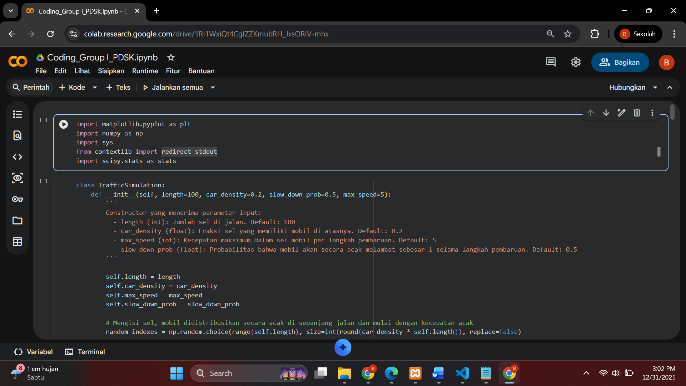
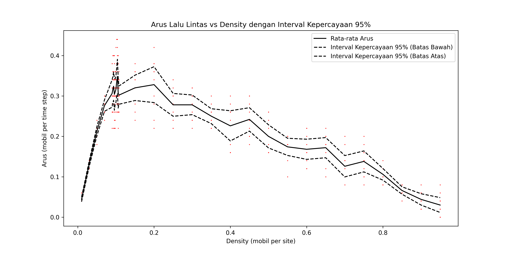
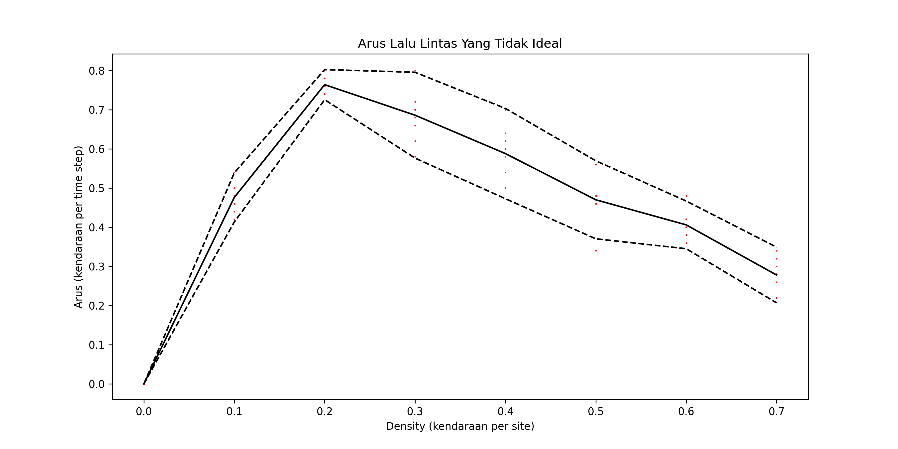

# 🚗 Traffic Flow Simulation using Cellular Automata

Proyek ini merupakan program simulasi arus lalu lintas berbasis **Cellular Automata (CA)** yang digunakan untuk memodelkan hubungan antara **kepadatan kendaraan (density)** dan **arus lalu lintas (traffic flow)** pada sebuah ruas jalan.  

Simulasi ini dikembangkan sebagai tugas project mata kuliah **Pemodelan dan Simulasi Komputer — Semester 4**  
Program Studi **Teknik Informatika — Universitas Sam Ratulangi**.

---

## 🎯 Tujuan Proyek

- 🔎 Menganalisis pengaruh kepadatan kendaraan terhadap arus lalu lintas  
- 🚦 Mensimulasikan fenomena kemacetan menggunakan pendekatan **Cellular Automata**  
- 📊 Menghasilkan visualisasi hubungan *density vs traffic flow*  
- 🧪 Melakukan pengujian melalui pendekatan statistik  
- 🎓 Mengaplikasikan konsep pemodelan & simulasi pada studi kasus nyata

---

## 🧩 Konsep & Pendekatan Simulasi

Simulasi mengadaptasi aturan dasar **model CA lalu lintas**, meliputi:

- ▶️ Akselerasi kendaraan  
- ⛔ Perlambatan karena jarak aman  
- 🎲 Perlambatan acak (*slow down probability*)  
- 🔁 Pemrosesan iteratif berbasis time‑step  

Parameter utama yang digunakan (lihat juga laporan proyek):

- Panjang jalan (*length*)  
- Kepadatan kendaraan (*car density*)  
- Kecepatan maksimum (*max speed*)  
- Probabilitas perlambatan (*slow_down_prob*)

Referensi konsep & parameter dijelaskan dalam laporan proyek halaman 1–4 dan 7–8 fileciteturn2file2turn2file3

---

## 🚀 Fitur Simulasi

- 💡 Simulasi arus lalu lintas dengan berbagai tingkat kepadatan
- 📈 Plot hubungan **density vs traffic flow**
- 📉 Analisis statistik deskriptif & inferensial
- 🎰 Dukungan unsur keacakan perilaku kendaraan
- 🧮 Output berbasis data simulasi (file txt + grafik)

---

## 🛠️ Teknologi yang Digunakan

- 🐍 Python (Google Colab / Jupyter Notebook)
- 📦 Numpy — data & komputasi numerik
- 📊 Matplotlib — visualisasi grafik
- 🧾 Notebook proyek: `Coding_Group 8_PDSK.ipynb`

---

## 🖼️ Cuplikan Hasil Simulasi

> Simpan gambar ke folder `asset/` (opsional) — atau gunakan path berikut

### 🐍 Tampilan Codingan


### 📊 Grafik Inferensial (Density vs Flow + CI 95%)


### ⚠️ Grafik Arus Tidak Ideal (Tanpa Perlambatan)


Kedua grafik ini sesuai dengan pembahasan hasil simulasi pada laporan halaman 4–6 fileciteturn2file3

---

## 📂 Struktur Proyek

```text
/simulasi-cellular-automata
 ├── Coding_Group 8_PDSK.ipynb
 ├── KepadatanRendah.txt
 ├── KepadatanTinggi.txt
 ├── plot1.png
 ├── plot2.png
 └── README.md
```

---

## 👥 Anggota Kelompok

- BRANDO M. ZUSRIADI  
- VINCENT J. DAREDA  
- NATHANAEL M. TUWAIDAN  
- SAVIO H. PALENDENG  

Program Studi  
**Teknik Informatika — Universitas Sam Ratulangi**

---

## 📌 Status Proyek

🟢 Academic Project — Completed  
🧪 Fokus implementasi:

- Pemodelan fenomena arus lalu lintas
- Simulasi berbasis Cellular Automata
- Analisis statistik hasil simulasi
- Visualisasi hubungan **density vs traffic flow**

---

## 📜 Lisensi Penggunaan

Proyek ini dibuat untuk keperluan akademik & pembelajaran.  
Penggunaan ulang diperbolehkan dengan mencantumkan atribusi yang sesuai.
